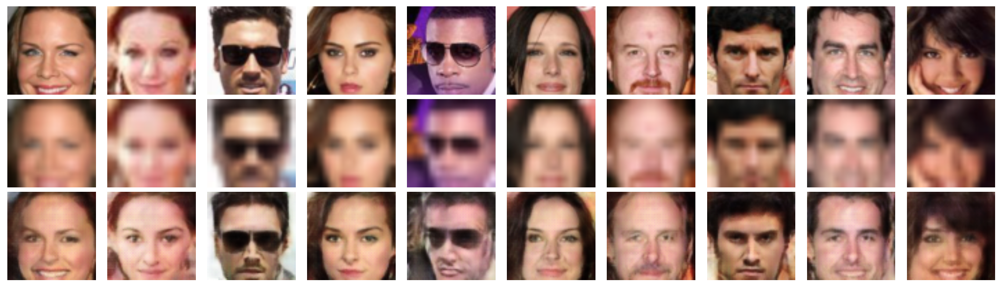
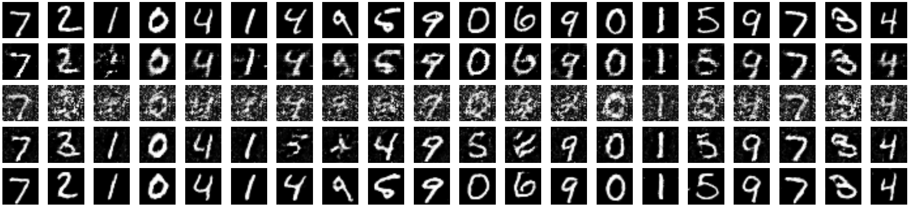
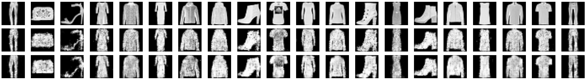

# Task-aware Compressed Sensing with Generative Adversarial Networks

This repository contains the implementation of our AAAI-18 paper:
[**Task-aware Compressed Sensing with Generative Adversarial Networks**](https://arxiv.org/abs/1802.01284)

If you find this code or the paper useful, please consider citing:
```
@inproceedings{kabkab2018task,
title={Task-aware Compressed Sensing with Generative Adversarial Networks},
author={Kabkab, Maya and Samangouei, Pouya and Chellappa, Rama},
booktitle={AAAI Conference on Artificial Intelligence},
year={2018}
}
```

## Contents

1. [Requirements](#requirements)
2. [Installation](#installation)
3. [Usage](#usage)
    - [Training a model](#training-a-model)
    - [Classification](#classification)
4. [Reproducing paper results](#reproducing-paper-results)
5. [Some results](#some-results)

## Requirements

- Python 2.7
- TensorFlow 1.5+ `pip install tensorflow-gpu`
- Scikit-learn `pip install scikit-learn`
- metric_learn `pip install metric_learn`
- pillow `pip install pillow`
- tqdm `pip install tqdm`
- requests `pip install requests`

## Installation

First clone this repository:

    $ git clone http://github.com/po0ya/csgan

Then download the datasets with:

    $ python download.py [mnist|fmnist|celeba]

Finally create this directory structure:

- `output` for saving the models `ln -s <path-to-proj-data>/output`
- `data` for datasets and intermediate files such as image means etc. `ln -s <path-to-proj-data>/data`
- `debug` for saving debug visualizations and test outputs, anything that can be removed after a day `ln -s <path-to-proj-data>/debug`
- `experiments` contains the configurations for different experiments, their logs, and their run scripts.

## Usage

For each experiment a set of hyper-parameters are set either via the `tf.flags` mechanism or read from a config file. The flags take precedence over the config file values.


### Training a model

We first need to generate an appropriate sampling matrix for the config file.

    $ python main.py --cfg <path-to-cfg> --generate_A

Now, we are ready to train a model.

    $ python main.py --cfg <path-to-cfg> --is_train <flags>

This will create an output directory based on the provided config files and flags. This directory will contain the TensorFlow checkpoints as well as the extracted features and the results of the evaluations for that experiment.

To save the reconstructions for a dataset, run:

    $ python main.py --cfg experiments/cfgs/csgan/<cfg_file>.yml \
                     --reconstruction_res \
                     --cs_learning_rate <lr> \
                     --cs_max_update_iter <max_update_iter> \
                     --cs_num_random_restarts <rr>

Refer to [main.py](main.py) and [configs](experiments/cfgs) for more information about flags.


### Classification

After a model is trained and the reconstructions are extracted, the features will be saved under the project output directory `output/default/<exp_name>/`.
The following python script trains a classifier with parameters specified in the classification config file. It also calculates the accuracy on the train and test splits.

    $ python classify.py --cfg experiments/cfgs/cls/<cfg_file>.yml \
                         --feature_file <experiment_output_dir>/cache_iter_<num_of_cs_iter>/<feature_filename> \
                         --test_split test
                         --validate

- The `--cfg` flag points to the classification config file. Note that this is different from the CSGAN config file. Sample configs can be found in `experiments/cfgs/cls/`
- The `--feature_file` specifies the path to the training features. <feature_filename> is typically given by `<split>_<feature>_lr<lr>_rr<rr>_m<measurements>_a<a_index>_c<counter>.pkl`, where split=[train|val|test], and feature=[x_hats|z_hats|measurements] (specifies which features to train on: reconstructed images, latent variables, or compressed measurements).
- The `--test_split` flag is optional (default=test). It sets which split (train|val|test) to test the classifier on.
- The `--validate` flag is optional (default=False). When set, a validation is done (using the validation set) and the best performing checkpoint is chosen. This is only needed for neural network classifiers.
- The `--retrain` flag is optional (default=False). When set, any existing checkpoints will be ignored, and training will start from scratch. Otherwise, training will resume from the most recent checkpoint. This is only needed for neural network classifiers.

## Reproducing paper results

To reproduce the results reported in the paper refer to [experiments/scripts](experiments/scripts) which contains one script per results Table:

### Notes:
- These experiments should be run from <proj_root>.
- Before running these scripts, first run `generate_As.sh` in order to generate the needed compressed sensing matrices.
- Each script runs its experiments in the background. `stdout` and `stderr` outputs of each run are redirected to a file `debug/<cfg>/<exp_file>`.

### Scripts

- `generate_As.sh` generates fixed random measurements matrices and save them into `<proj_root>/output/sampling_mats/`. Usage:

        ./experiments/scripts/generate_As.sh

- `diff_measurements_base.sh` Trains and tests models with various numbers of measurements.

        ./experiments/scripts/diff_measurements_base.sh <path-to-cfg> <comma-separated list of numbers of measurements (10,20,100)> <extra configs (optional)>

- `figure_1_{mnist|fmnist|celeba}_reconstruction.sh` runs the experiments for Figure 1 using `diff_measurements_base.sh`.

        ./experiments/scripts/figure_1_{mnist|fmnist|celeba}_reconstruction.sh

- `table_1_base.sh` trains and tests models with different numbers of uncompressed training data.

        ./experiments/scripts/figure_1_base.sh <path-to-cfg> <comma-separated list of numbers of samples (100,1000,8000)> <extra configs (optional)>

- `table_1_{csgan|dcgan}.sh` runs the experiments of Table 1 using `table_1_base.sh`.

        ./experiments/scripts/table_1_{csgan|dcgan}.sh

- `table_2_{random|superres}.sh` runs the experiments of Table 2 using `table_1_base.sh`.

        ./experiments/scripts/table_2_{random|superres}.sh

- `table_3.sh` runs the experiments of Table 3.

        ./experiments/scripts/table_3.sh

- `diff_measurements_base.sh` trains and tests models with different numbers of measurements, and extracts all features of {train|val|test} sets.

        ./experiments/scripts/diff_measurements_base_all.sh <path-to-cfg> <comma-separated number of measurements (10,20,100)> <extra configs (optional)>

- `table_4_5_{mnist|fmnist}.sh` runs the experiments for training models with a discriminative latent space of Table 4 and 5.

        ./experiments/scripts/table_4_5_{mnist|fmnist}.sh

- `cl_base.sh` The base script for classifying the saved features of each experiment. The path of the saved training features from `table_4_5_{mnist|fmnist}.sh` should be provided.

        ./experiments/scripts/cl_base.sh <classifier config> <path-to-train-features>

The corresponding hyper-parameters for all scripts can be found/set in [experiments/cfgs](experiments/cfgs)


## Some results
CelebA super-resolution results. Top row: original image; middle row: blurred image; bottom row: reconstructed image.


MNIST reconstruction results with m = 200. Top to bottom rows: original images, reconstructions with NC = 0, reconstructions with NC = 100, reconstructions with NC = 1,000, and reconstructions with NC = 8,000.


Fashion-MNIST reconstruction results when only compressed training data is available. Top row: original image; middle row: reconstructed image from m = 200 measurements; bottom row: reconstructed image from m = 400 measurements.

